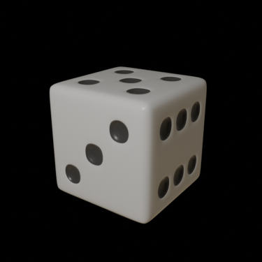
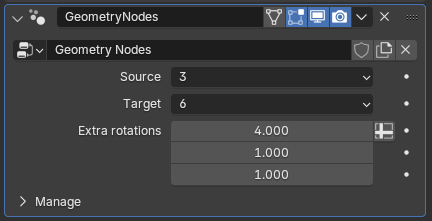
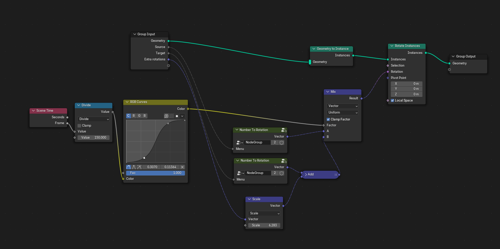

# Making dice animations in Blender

I got a question from a friend that is coding a monopoly game if I could make some dice animations. I decided it could be a fun project and I ended up using some automation techinques that worked well and seemed to be worth a few notes.

## Making the dice model
Making a dice model is a rather easy task and several tutorials have been published. I used [this method](https://youtu.be/z3puJoeuBf0?si=A3ju5Pj-N2363Ilv) and ended up with this dice:



## Animation

I decided to used geometry nodes for animation of the dice since I wanted to be able to specify start and end side so that I could animate transitions from any side to any other side.

The geometry nodes interface ended up as below



Where source and target represents the initial face and final dice state. To make the animation look fun I allowed for some extra rotations to be specified.

The implementation is rather straight forward. The idea is to use a mix node to allow interpolation between the initial and final rotations.



The rgb curves node is used to slow the animation down at the start and end.

## Rendering

I needed one animation for each pair of start and end side which means $6 * 6 = 36$ in total. To avoid having to manually set filename, start and end side for each of these a simple script was created:

```python
import bpy

for source in range(6):
    for target in range(6):
        bpy.context.object.modifiers["GeometryNodes"]["Socket_2"] = source
        bpy.context.object.modifiers["GeometryNodes"]["Socket_3"] = target
        bpy.context.scene.render.filepath = "//renders/dice_" + str(source+1) + "_" + str(target+1) + ".mp4"
        bpy.ops.render.render(animation=True)
```

## Final note

One example animation, illustrating the transition from 3 to 6, can be viewed [here](https://youtube.com/shorts/H0_-ogVngHA?si=g7zIvH0ZLH0dv0e2).

The blender file can be downloaded [here](resources/dice_final.7z).


