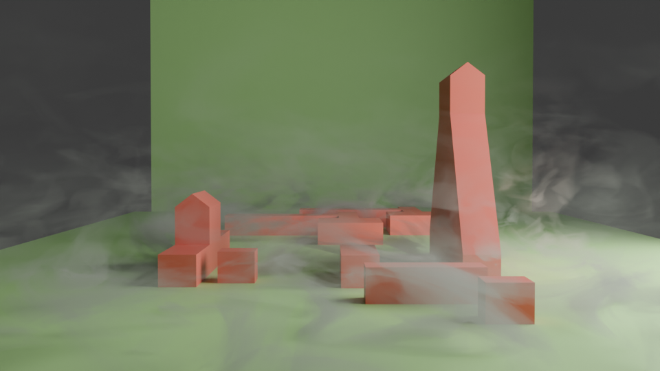
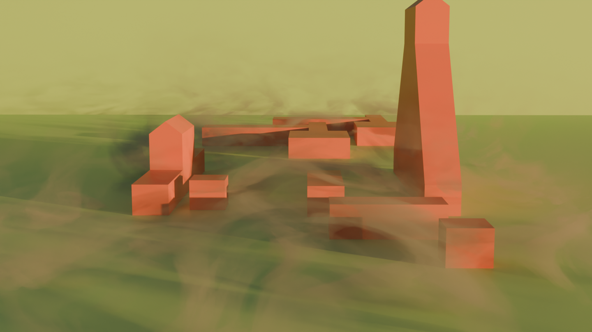

# Procedural fog using volumetrics in Blender

Just a quick note on a method to get veil of mist in Blender.

Create a cube that surrounds the scene and add a (volumetric) material to it. 

Setup the following nodes.

## Example renders

## Blender file

[procedurla fog.blend](procedural%20fog.blend)
