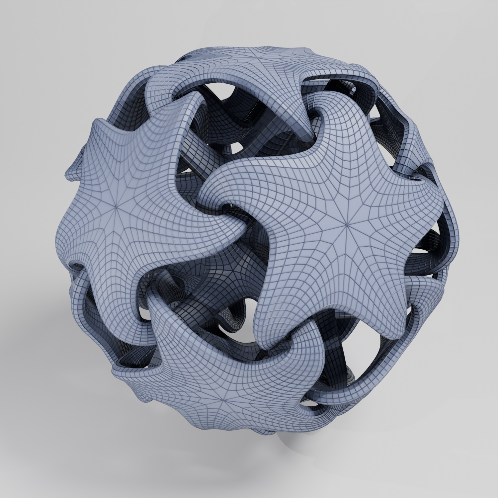
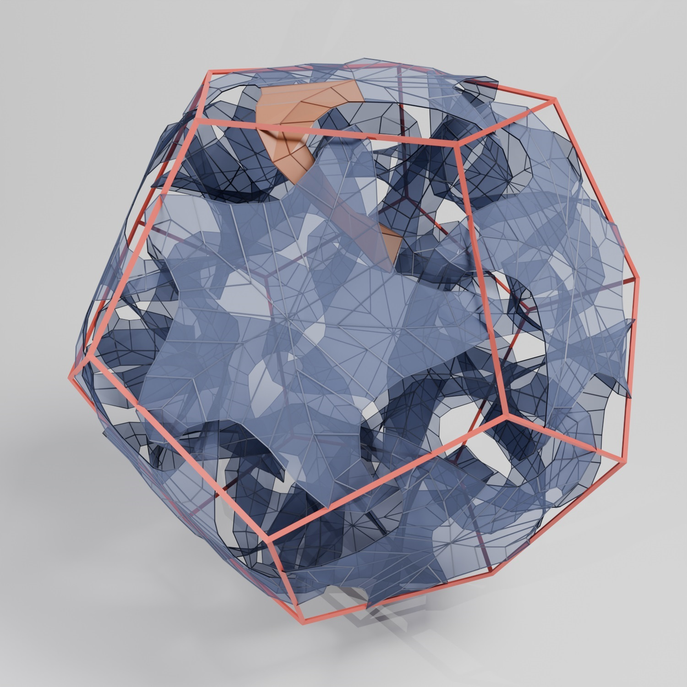

# Making a quintrino in Blender

This is an example of a quintrino rendered in Blender.

On [Paul Nylander's awesome page for mathematical artwork](http://www.bugman123.com/Math/index.html) you can find one [^1]  along with some mathematica code to construct one.

This article explains how to make on in Blender using python scripting.

It is not important to have a deep understanding of the underlying math to follow along. 

Let's start by looking at at this image.

First we note that the quintrino is a closely related to a shape built out of regular pentagons that is called a dodecahedron. 

The next thing to note is that it is built up from a multitude of identical arms (illustrated in red). Five arms can form a star and for each face in the docecahedron we can place a star. This is all we need to construct the quintrino.

For this article we will take the geometry of the arm as given an not try to construct it. 

[^1]: He does not use the term quintrino and the term is not widely used (yet?).