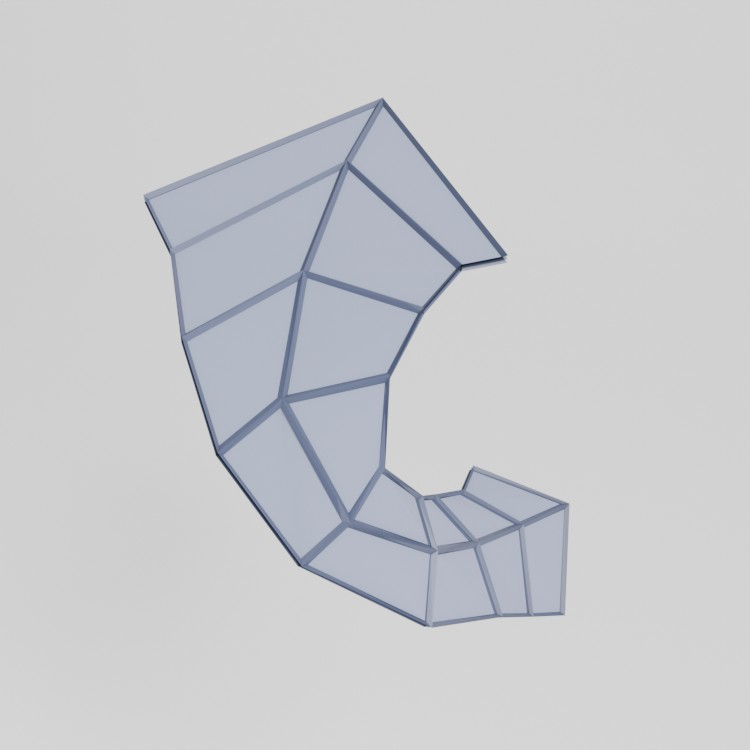
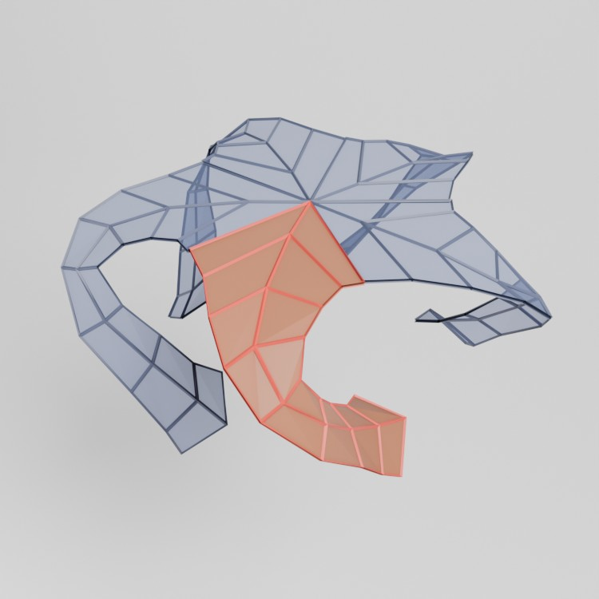

# Making a quintrino in Blender

This is an example of a quintrino rendered in Blender.


On [Paul Nylander's awesome page for mathematical artwork](http://www.bugman123.com/Math/index.html =250x) you can find one [^1]  along with some mathematica code to construct one. This article explains how to make on in Blender. There are ofcourse many ways to do it and this approach
is using python scripting for a fully automatic solution[^2]. If you just want to skip to the code feel free to get it [here](script.py) otherwise continue reading. It is not important to have a deep understanding of the underlying math to follow along.

Let's start by looking at at this image.


First we note that the quintrino is a closely related to a shape built out of regular pentagons that is called a dodecahedron. The next thing to note is that it is built up from a multitude of identical arms (illustrated in red)[^3]. Five arms can form a star and for each face in the docecahedron we can place a star. All we need is to figure out how to rotate the arm to place it correctly.

## Creating the arm
For this article the mesh data for the arm is given. A mesh can be stored in many ways. For blender user the most common way is ofcourse to embed it into a blender file. However, it is nice to keep everything as code so instead the arm mesh is constructed using the function below.

```python
def createArm():
    line1 = [(0.11, 0.35, 1), (0.16, 0.33, 1), (0.23, 0.35, 0.99), (0.3, 0.38, 0.96), (0.35, 0.43, 0.9), (0.29, 0.42, 0.8), (0.22, 0.37,0.7), (0.14, 0.34, 0.62), (0.078, 0.296, 0.585)]
    line2 = [(0, 0, 1), (0.13, 0.09, 1), (0.29, 0.22, 0.99), (0.4, 0.33, 0.95), (0.41, 0.45, 0.88), (0.31, 0.47, 0.77), (0.2, 0.43, 0.65), (0.08, 0.4, 0.56), (-0.019, 0.398, 0.526)]
    line3 = [(0.36, 0, 1), (0.39, 0.11, 1), (0.45, 0.23,0.99), (0.49, 0.35, 0.95), (0.47, 0.45, 0.86), (0.36, 0.52, 0.73), (0.22, 0.5, 0.59), (0.13, 0.48, 0.48), (0.07, 0.489, 0.437)]

    vertices = []
    faces = []

    for i in range(len(line1)):
        vc = len(vertices)
        vertices.append(line1[i])
        vertices.append(line2[i])    
        vertices.append(line3[i])    
        if vc > 0:
            faces.append([vc-3, vc-3+1, vc+1, vc])
            faces.append([vc-3+1, vc-3+2, vc+2, vc+1])

    armmesh = bpy.data.meshes.new("ArmMesh")
    armmesh.from_pydata(vertices, [], faces)
    armmesh.update()

    arm = bpy.data.objects.new("Arm", armmesh)
    return arm
```

This gives us




## Creating a star

In order to create a star we need to be able to rotate the arm. This helper function is used for that purpose.

```python
def rotate(rx, ry, rz):
    rotation_z1 = Matrix.Rotation(math.pi - rz, 4, 'Z')
    rotation_x = Matrix.Rotation(ry, 4, 'X')
    rotation_z2 = Matrix.Rotation(math.pi - rx, 4, 'Z')
    mat = rotation_z1 @ rotation_x @ rotation_z2
    return mat
```

The function has been crafted to immitate the mathematica function `RotateShape` [^4] so that we can reuse the same angles of rotation as Paul Nylander. We can now create a star using this function:

```python
def createStar(armTemplate):
    for i in range(5):
        arm = armTemplate.copy()        
        arm.matrix_world @= rotate(0, 0, i * 0.4 * math.pi)
```

This gives us



## Rotating stars to form the final shape

We need to rotate entire stars to align them the surfaces of the dodecahedron. To do that we can extend the `createStar` function to accept a parent rotation.

```python
def createStar(armTemplate, parentRotationX, parentRotationY, parentRotationZ):
    for i in range(5):
        arm = armTemplate.copy()    
        parentRotation = rotate(parentRotationX, parentRotationY, parentRotationZ)
        arm.matrix_world @= parentRotation @ rotate(0, 0, i * 0.4 * math.pi)
```

We can now place the stars

```python
# Dihedral angle, ~116.57°
alpha = math.acos(-math.sqrt(5)/5)

# Top 
createStar(armTemplate, 0, 0, 0)

# Upper ring (5 stars)
for i in range(5):
    createStar(armTemplate, 0, math.pi - alpha, psi + math.pi/5)

# Lower ring (5 stars)
for i in range(5):
    createStar(armTemplate, math.pi/5, alpha, psi)

# Bottom
createStar(armTemplate, 0, math.pi, 0)
```


[^1]: He does not use the term quintrino and the term is not widely used (yet?).
[^2]: A manual construction method is given by Idirko on this youtube link https://www.youtube.com/watch?v=P_bKkguxS3o&ab_channel=ldirko
[^3] For this article we will take the geometry of the arm as given an not try to construct it. 
[^4] `RotateShape` was removed from mathematica at some point but the definition can be found here https://reference.wolfram.com/language/Compatibility/tutorial/Graphics/Shapes.html#428139677